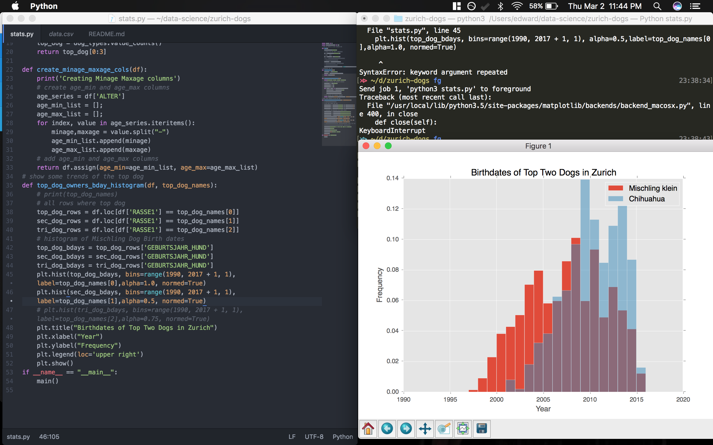

# My First Machine Learning Project
I found a fun dataset about the dogs of Zurich, Switzerland on Kaggle.
I will build figures, classifiers, and other fun data related things around this dataset.
I will be using __Tensorflow__, __Numpy__, and __Pandas__.
# Pandas / matplotlib warmup
Located in `stats.py`, shows trending dogs and information about their owners

# Linear classifier
Classifies the gender of the owner based on dog features.
```
accuracy: 0.686246
accuracy/baseline_label_mean: 0.313754
accuracy/threshold_0.500000_mean: 0.686246
auc: 0.5
global_step: 150
labels/actual_label_mean: 0.313754
labels/prediction_mean: 2.76343e-07
loss: 4.78862
precision/positive_threshold_0.500000_mean: 0.0
recall/positive_threshold_0.500000_mean: 0.0
```
# Neural Network classifier
Work in progress

# Dataset Notes
Since German is the official language of Zurich most of the columns are in German but the translations to English aren't too tricky

1. ALTER -> Age
2. GESCHLECHT -> Gender
3. STADTKREIS -> City Quarter or District
4. RASSE1 -> Dog's Primary Breed
5. RASSE2 -> Dog's Secondary Breed
6. GEBURTSJAHR_HUND -> Dog's Year of Birth
7. GESCHLECHT_HUND -> Dog's Gender
8. HUNDEFARBE -> Dog's Color
